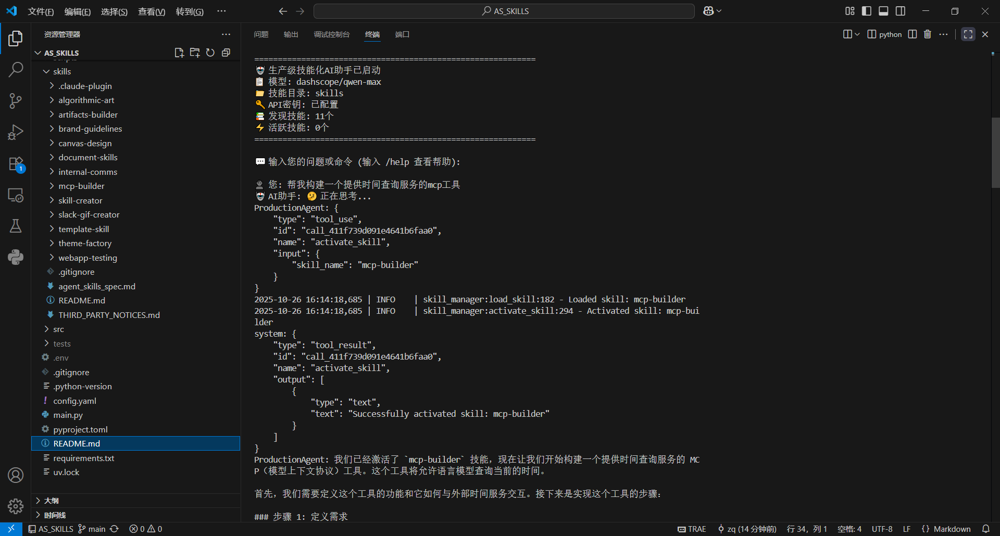
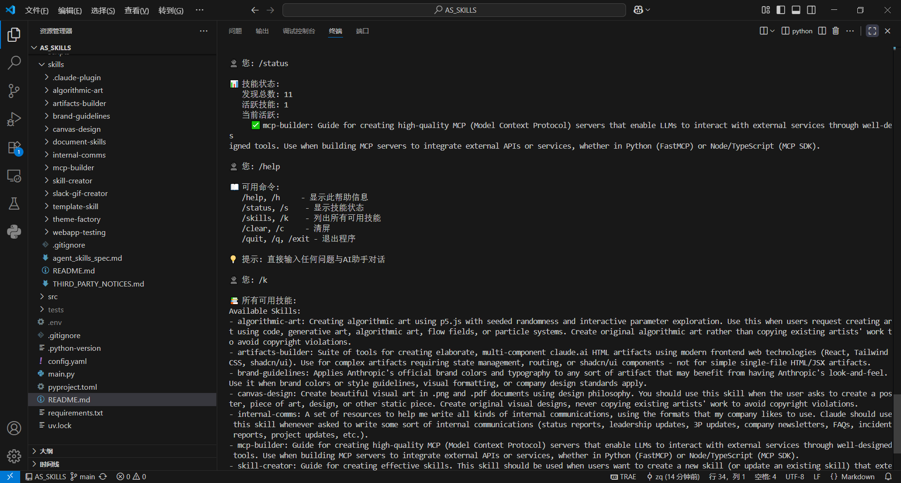

# AS_SKILLS - 技能化AI框架

[](https://www.python.org/)
[](https://github.com/astral-sh/uv)

这是一个基于AgentScope框架的AI助手应用，支持自动技能发现、智能任务匹配和终端交互，兼容Claude Skills文件格式。

## 🚀 特性

- **🤖 智能代理**: 基于AgentScope框架的ReAct代理
- **🔧 技能系统**: 自动技能发现和激活，兼容Claude Skills文件格式
- **📊 多模态支持**: 支持文档处理、数据分析、Web测试等
- **⚡ 高性能**: 异步处理和并发执行
- **🛠️ 开发友好**: 完整的配置管理和错误处理

## 📊 项目状态

> **当前版本**: v1.0.0
> 
> **✅ 已实现**:
> - 基础AgentScope集成
> - 技能发现和管理系统
> - 配置文件管理
> - 基础错误处理
> 
> **🚧 开发中**:
> - 完整的测试覆盖
> - API文档完善
> - 性能优化
> - 安全沙箱实现
> - 可视化界面


## 📁 项目结构

```
AS_SKILLS/
├── src/                    # 核心源代码
│   ├── __init__.py
│   ├── config_loader.py
│   ├── skill_manager.py
│   ├── skilled_react_agent.py
│   └── main_production.py
├── skills/                 # 技能模块
│   ├── algorithmic-art/
│   ├── artifacts-builder/
│   ├── brand-guidelines/
│   ├── canvas-design/
│   ├── document-skills/
│   ├── internal-comms/
│   ├── mcp-builder/
│   ├── skill-creator/
│   ├── slack-gif-creator/
│   ├── template-skill/
│   ├── theme-factory/
│   └── webapp-testing/
├── docs/                   # 文档目录（待完善）
├── scripts/                # 工具脚本目录（待完善）
├── logs/                   # 日志文件目录
├── config.yaml             # 配置文件
├── pyproject.toml          # 项目配置
├── requirements.txt        # 依赖列表
├── uv.lock                # 依赖锁定文件
├── .python-version        # Python版本指定
└── main.py                # 主入口
```

## 🛠️ 环境要求

- Python 3.10+ (推荐 3.11)
- uv 包管理器
- DASHSCOPE_API_KEY 环境变量

## 📦 安装和运行

### 1. 克隆项目
```bash
git clone <repository-url>
cd AS_SKILLS
```

### 2. 设置环境
```bash
# 安装依赖（推荐方式）
uv sync

# 或者传统方式
uv venv
source .venv/bin/activate  # Linux/Mac
# 或 .venv\Scripts\activate  # Windows
uv pip install -r requirements.txt
```

### 3. 配置环境变量
创建 `.env` 文件：
```env
DASHSCOPE_API_KEY=your-api-key-here
```

### 4. 运行项目
```bash
# 推荐方式
uv run python main.py

# 或直接运行（需要先激活虚拟环境）
python main.py
```

## 🔨使用截图



## 🔧 技能模块（Claude Skills兼容）

项目包含12个专业技能模块(来自Claude Skills开源项目)：

### 📊 数据分析
- **algorithmic-art**: 算法艺术生成
- **artifacts-builder**: 构建工具

### 🎨 设计工具
- **brand-guidelines**: 品牌指南
- **canvas-design**: 画布设计
- **theme-factory**: 主题工厂

### 📄 文档处理
- **document-skills**: 文档处理 (PDF/DOCX/PPTX/Excel)

### 🌐 Web技术
- **webapp-testing**: Web应用测试
- **mcp-builder**: MCP构建器

### 📢 通信工具
- **internal-comms**: 内部通信
- **slack-gif-creator**: Slack GIF创建器

### 🔧 开发工具
- **skill-creator**: 技能创建器
- **template-skill**: 模板技能

## 🎯 使用方法

### 基本对话
```bash
python main.py
```

### 技能操作
```bash
# 查看可用技能
/help

# 查看技能状态
/status

# 激活特定技能
/activate_skill <skill_name>
```

## 🧪 开发

### 代码质量工具
```bash
# 代码格式化（已安装）
uv run black src/

# 类型检查（已安装）
uv run mypy src/

# 代码风格检查（已安装）
uv run flake8 src/
```

### 测试（待实现）
```bash
# 测试框架已安装，但测试用例待开发
# uv run pytest tests/
```

### 开发环境设置
```bash
# 安装开发依赖
uv sync --dev

# 查看项目配置
cat pyproject.toml
```

## 📚 相关文档

文档请参考：
- [AgentScope文档](https://doc.agentscope.io/zh_CN/index.html)
- [Claude Skills文档](https://github.com/anthropics/skills)

## 📮 联系方式
如有问题或建议或其他合作需求，请通过以下方式联系我们：
- **邮箱**: [yl_zhangqiang@foxmail.com](mailto:yl_zhangqiang@foxmail.com)

## 🤝 贡献

欢迎提交Issue和Pull Request！

### 开发流程
1. Fork项目
2. 创建功能分支
3. 提交更改
4. 创建Pull Request

## 🙏 致谢

感谢所有为这个项目做出贡献的开发者！

---

**AS_SKILLS** - 让AI更智能，让工作更高效 🚀


